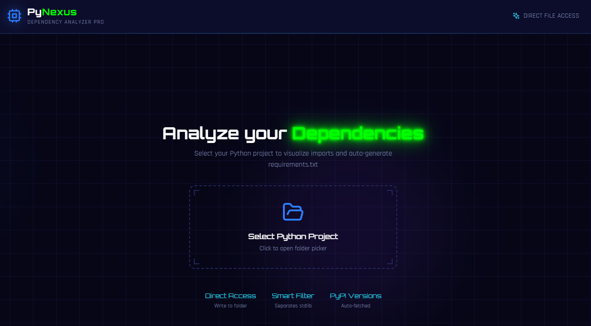

# 🌌 PyNexus ⚡

> **A futuristic, local-first Python dependency visualizer.**

[](https://react.dev/)
[](https://vitejs.dev/)
[](https://tailwindcss.com/)
[](https://opensource.org/licenses/MIT)



---

## Description

**PyNexus** is a sleek Single Page Application (SPA) built with **React** and **Vite** that analyzes your Python projects **entirely locally**—no server uploads, no cloud dependencies. It scans your codebase to visualize import relationships and automatically generates clean `requirements.txt` files.

Featuring a stunning **Cyberpunk / Dark Mode** design, PyNexus transforms the mundane task of dependency management into an immersive, visually captivating experience.

---

## Test the online app !


<a href="https://qurnt1.github.io/PyNexus/">Cliquez ici</a>


---
## ✨ Features

- 🔒 **Local-First:** Leverages the browser's `File System Access API` to read and write directly to your disk. Your code never leaves your machine.
- 🕸️ **Constellation View:** Interactive dependency graph with smooth zoom & pan, powered by `react-force-graph`.
- 🧠 **Smart Detection:** Intelligently distinguishes Python's Standard Library (StdLib) from third-party packages (PyPI).
- ⚡ **Auto-Versioning:** Fetches the latest package versions directly from the PyPI API.

---

## 🚀 Quick Start

```bash
git clone https://github.com/qurnt1/PyNexus.git
cd PyNexus
npm install
npm run dev
```

---

## 🌐 Browser Compatibility

| Feature | Chrome / Edge / Opera | Firefox / Safari |
|---------|:---------------------:|:----------------:|
| **Read Project Files** | ✅ Full Support | ✅ Full Support |
| **Write `requirements.txt` Directly** | ✅ Full Support | ❌ Download Only |

> [!TIP]
> For the best experience with direct file writing capabilities, **Chrome**, **Edge**, or **Opera** are recommended.

---

## 🛠️ Tech Stack

| Technology | Purpose |
|------------|---------|
| **React** | UI Components |
| **Vite** | Build Tool & Dev Server |
| **Tailwind CSS** | Styling |
| **Lucide Icons** | Icon Library |
| **Framer Motion** | Animations |

---

## 📄 License

This project is licensed under the **MIT License**. See the [LICENSE](LICENSE) file for details.

---

<p align="center">
  Made with 💜 by <a href="https://github.com/qurnt1">qurnt1</a>
</p>